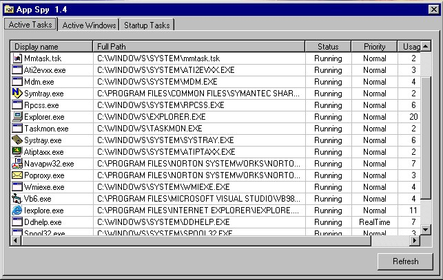



## App Spy \(my version\)

### Description

This is a combination of three programs found here on PSC. It enumerates active programs and their windows. I left in the original Startup programs list. I did add a few extras of my own, although, it is mostly based upon App Spy by some bloke. The orginal App Spy was here last month but not any more so I do not know who to give credit to...
 
### More Info
 
Tested on W98 only, so bug off if you can not get it to run on NT or 2K.

             |
---                |---
**Submitted On**   |2001-10-30 21:34:50
**By**             |[Gregory Kirk](https://github.com/Planet-Source-Code/PSCIndex/blob/master/ByAuthor/gregory-kirk.md)
**Level**          |Intermediate
**User Rating**    |4.5 (18 globes from 4 users)
**Compatibility**  |VB 6\.0
**Category**       |[Complete Applications](https://github.com/Planet-Source-Code/PSCIndex/blob/master/ByCategory/complete-applications__1-27.md)
**World**          |[Visual Basic](https://github.com/Planet-Source-Code/PSCIndex/blob/master/ByWorld/visual-basic.md)
**Archive File**   |[App Spy \(m3218710312001\.zip](https://github.com/Planet-Source-Code/gregory-kirk-app-spy-my-version__1-28536/archive/master.zip)

